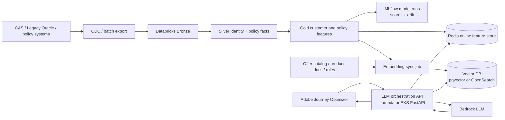

# AI Vector DB Extension For CCE MLOps

Yes, the existing CCE MLOps design can add an AI vector DB extension. The vector DB should complement, not replace, the current Databricks/MLflow, Redis and Feature API responsibilities.

The current CCE project already has:

```text
Legacy / CAS / policy / transaction data
  -> Bronze / Silver / Gold feature engineering
  -> MLflow-style model runs, scores and drift metrics
  -> Redis online feature store
  -> FastAPI Feature API
  -> AJO / campaign decisioning
```

The extension adds semantic retrieval for LLM use cases:

```text
Gold customer features + policy features + offer catalog + product docs
  -> embedding generation
  -> vector DB
  -> LLM orchestration API
  -> Bedrock-generated best offer, explanation or campaign copy
  -> AJO / CDP / campaign tools
```

## What The Vector DB Adds

| Use case | Existing MLOps asset | Vector DB value |
| --- | --- | --- |
| Best offer explanation | Customer segments, model scores, policy features | Retrieve similar customers, relevant product docs and offer rules |
| LLM campaign copy | Gold features and candidate offers | Ground generated message in approved offer/product context |
| Advisor or marketer Q&A | Feature lineage, model runs, drift output | Answer "why this customer/segment/offer" with source context |
| Similar-customer analysis | User profile and policy feature tables | Fast nearest-neighbor lookup over behavior/profile embeddings |
| Model monitoring | Drift metrics and model-run metadata | Track embedding drift, index freshness and retrieval quality |

## Target Architecture



## Offline Data Flow

```text
1. Databricks builds Gold customer features, policy features and segment outputs.
2. MLflow records model run, feature version, score version and drift metrics.
3. Embedding sync job reads approved Gold features and offer/product documents.
4. The job builds normalized text views for each entity.
5. Embedding model converts each view into a vector.
6. Vector DB upserts vectors with metadata and index version.
7. Evaluation checks retrieval quality against golden questions and known customer/offer cases.
```

The embedding job should be a scheduled Databricks job, EMR job, EKS CronJob or Airflow task. It should not run inside the user-facing Feature API request path.

## Online Data Flow

```text
AJO sends user_id and campaign context
  -> orchestration API
  -> parallel lookup:
       Redis: latest online features and candidate offers
       Vector DB: similar customers, product docs, policy/offer snippets
  -> prompt assembly with source references
  -> Bedrock model call
  -> structured response:
       offer_id
       confidence
       reason
       personalized_message
       fallback_offer_id
  -> AJO consumes the result
```

Fallback rule:

```text
If vector DB or LLM is slow/unavailable:
  return precomputed segment offer from Redis
  log degraded_mode=true
```

## Suggested Data Structures

Gold Delta table:

```sql
CREATE TABLE gold.user_profile_daily (
  unified_customer_key STRING,
  business_date DATE,
  age_band STRING,
  region STRING,
  total_policies INT,
  total_premium DECIMAL(18,2),
  active_policy_types ARRAY<STRING>,
  expiring_policy_count_90d INT,
  ltv_score DOUBLE,
  churn_risk DOUBLE,
  segment_ids ARRAY<STRING>,
  next_best_action STRING,
  feature_version STRING
)
PARTITIONED BY (business_date);
```

Gold recommendation output:

```sql
CREATE TABLE gold.user_segment_recommendation (
  business_date DATE,
  unified_customer_key STRING,
  segment_id STRING,
  candidate_offers ARRAY<STRUCT<
    offer_id: STRING,
    product_id: STRING,
    score: DOUBLE,
    reason_code: STRING
  >>,
  model_version STRING
)
PARTITIONED BY (business_date);
```

PostgreSQL pgvector option:

```sql
CREATE EXTENSION IF NOT EXISTS vector;

CREATE TABLE vector.user_embeddings (
  unified_customer_key TEXT PRIMARY KEY,
  business_date DATE NOT NULL,
  embedding VECTOR(<embedding_dim>) NOT NULL,
  metadata JSONB NOT NULL,
  feature_version TEXT NOT NULL,
  embedding_model TEXT NOT NULL,
  index_version TEXT NOT NULL,
  updated_at TIMESTAMPTZ NOT NULL DEFAULT now()
);

CREATE TABLE vector.offer_embeddings (
  offer_id TEXT PRIMARY KEY,
  product_id TEXT NOT NULL,
  embedding VECTOR(<embedding_dim>) NOT NULL,
  metadata JSONB NOT NULL,
  effective_from DATE,
  effective_to DATE,
  embedding_model TEXT NOT NULL,
  updated_at TIMESTAMPTZ NOT NULL DEFAULT now()
);

CREATE TABLE vector.document_chunks (
  chunk_id TEXT PRIMARY KEY,
  document_id TEXT NOT NULL,
  document_version TEXT NOT NULL,
  source_uri TEXT NOT NULL,
  chunk_text TEXT NOT NULL,
  embedding VECTOR(<embedding_dim>) NOT NULL,
  metadata JSONB NOT NULL,
  updated_at TIMESTAMPTZ NOT NULL DEFAULT now()
);

CREATE INDEX user_embeddings_hnsw
ON vector.user_embeddings
USING hnsw (embedding vector_cosine_ops);

CREATE INDEX offer_embeddings_hnsw
ON vector.offer_embeddings
USING hnsw (embedding vector_cosine_ops);
```

Redis still owns hot online features:

```text
customer:{unified_customer_key}:features
policy:{policy_id}:features
segment:{segment_id}:offers
```

Vector DB owns semantic context:

```text
similar customers
offer/product embeddings
document chunks
campaign-rule snippets
```

## Vector DB Choice

| Option | Fit for this CCE extension | Trade-off |
| --- | --- | --- |
| Aurora PostgreSQL pgvector | Medium data volume, SQL metadata filters, easier start | Retrieval scale and full-text search are limited compared with search engines |
| OpenSearch Serverless vector engine | Hybrid search, larger document set, multi-index operations | More search tuning and cost controls |
| Milvus on EKS | Self-managed vector specialization | Highest platform operations burden |
| Bedrock Knowledge Bases | Product/offer document RAG without custom schema | Less control for customer-feature embeddings |

Recommended path:

```text
Start with pgvector for customer/offer embeddings.
Use Bedrock Knowledge Bases or OpenSearch for larger product/document knowledge.
Keep Redis as the serving fallback and low-latency feature store.
```

## MLOps Changes

Add these artifacts to model and feature governance:

| Artifact | Owner | Why |
| --- | --- | --- |
| `embedding_model` | ML platform | Embedding vectors are model outputs and need version tracking |
| `chunking_version` | Data platform | Chunking changes can change retrieval quality |
| `index_version` | Platform / search | Enables rollback of a bad index |
| `retrieval_eval` | MLOps | Tracks top-k hit rate, citation coverage and query quality |
| `embedding_drift` | MLOps | Detects major semantic shift in customer/product vectors |
| `llm_prompt_version` | App / MLOps | Makes generated best-offer answers reproducible |

New monitoring signals:

```text
Vector DB: query latency, index size, update lag, failed upserts
Retrieval: top-k hit rate, empty result rate, source coverage
LLM: p95 latency, timeout rate, cost per request, fallback rate
AJO path: end-to-end latency, response schema validity, campaign conversion
```

## Kubernetes / Deployment Extension

Optional new deployables:

```text
deploy/k8s/embedding-sync-cronjob.yaml
deploy/k8s/rag-orchestrator-deployment.yaml
deploy/k8s/rag-orchestrator-service.yaml
deploy/k8s/vector-db-secret.yaml
```

Deployment options:

| Option | Use when | Note |
| --- | --- | --- |
| Same EKS cluster, separate namespace | Existing CCE cluster has capacity and network policies | Fastest path |
| Separate AI serving cluster | Strong isolation, separate scaling or security boundary needed | Higher ops cost |
| Lambda orchestrator | Simple AJO integration and modest request volume | Watch timeout and VPC networking |
| ECS/Fargate orchestrator | No Kubernetes requirement but containerized runtime desired | Good middle ground |

CI/CD should build the embedding job and orchestration API images, run retrieval evaluation, apply infrastructure changes and deploy through GitOps or controlled pipeline approval.

## CPU And Latency Consideration

CPU is reasonable for:

- Scheduled embedding sync with low urgency.
- Small reranker models at low top-k.
- Private, low-QPS fallback generation where seconds of latency are acceptable.

CPU is risky for:

- High-QPS interactive AJO offer generation.
- Long prompt generation with strict p95 latency targets.
- Campaign journeys where timeout causes lost conversion.

For production-like interactive use, keep Bedrock or a GPU-backed endpoint on the critical path and preserve Redis segment-offer fallback.

## Automation Value

This extension converts the existing MLOps platform into an AI-assisted marketing automation platform:

- Marketers do not manually search product rules and customer feature tables.
- AJO can request a best offer with structured reasons and approved context.
- SMEs can review source citations instead of reconstructing model reasoning by hand.
- Drift, retrieval quality and prompt versions become measurable release artifacts.
- The fallback path keeps campaign automation running when LLM services degrade.

## Relationship To Other Docs

This extension builds on:

```text
ARCHITECTURE_MLOPS_GRAPHML_DEPLOYMENT.md
REALTIME_FEATURE_PLATFORM_480K.md
BIG_DATA_EMR_DELTA_EXTENSION.md
OPERATIONS_MATURITY_AND_COST.md
```

For a standalone enterprise document knowledge base, see the KB repo pointer:

```text
../../corporate-knowledge-base-poc/README.md
```
