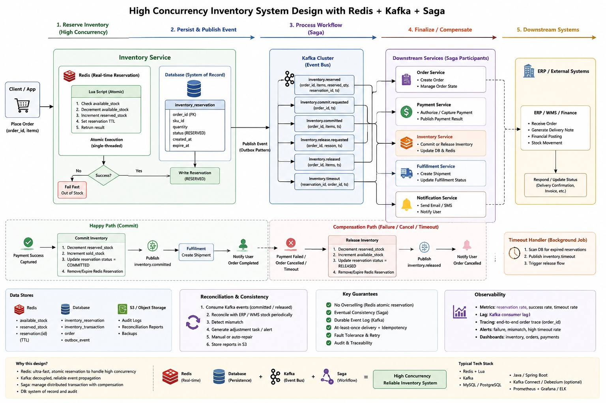

# Inventory OMS PoC

Spring Boot / Java reference for high-concurrency inventory reservation, Kafka-ready event handoff, Saga compensation and reconciliation.

This is the original OMS microservice-style PoC. Keep it beside `../oms-oltp-poc`: this project shows the Java / Spring Boot / DDD service shape, while the Python companion keeps the same OLTP ideas compact for side-by-side comparison with the OEE and CCE data-platform PoCs.

## Architecture Diagram



## What This Shows

- Inventory reservation service using a Spring Boot-style controller / service / repository layout
- DDD-friendly OMS boundaries: Order, Inventory, Payment, Fulfillment and Notification
- High-concurrency stock reservation pattern with Redis + Lua in the target architecture
- Database as system of record for reservations, orders and Outbox events
- Kafka-ready event flow for `inventory.reserved`, `inventory.committed`, `inventory.released` and timeout events
- Saga happy path and compensation path for payment failure, cancellation or reservation timeout
- Reconciliation job for inventory consistency checks against ERP / WMS / finance systems

## Local Structure

```text
inventory-oms-poc/
  README.md
  run.sh
  docker-compose.yml
  Makefile
  reservation-service/
    pom.xml
    src/main/java/com/poc/reservation/
      ReservationApplication.java
      controller/ReservationController.java
      service/ReservationService.java
      repository/ReservationRepository.java
      entity/Reservation.java
  reconciliation-job/
    pom.xml
    src/main/java/com/poc/recon/ReconciliationJob.java
```

## Design Narrative

For OLTP, the inventory service owns the current stock truth. The hot path reserves stock quickly, persists the reservation, and emits durable events through an Outbox/Kafka-style handoff. Downstream services then create orders, capture payments, update fulfillment status and notify users.

The same events can later feed OLAP systems. That is the bridge to the other PoCs in this repository: OMS produces operational facts, while OEE and CCE consume historical data for dashboards, features and decision support.

## From Events To OLAP Contracts

For OLAP, the important signal is not only the latest order or stock value, but how that value changed over time. The OMS Outbox events can become the immutable timeline for downstream models: facts, daily snapshots and slowly changing dimensions.

This is where data contracts and metadata governance matter:

- Data contract defines the producer-consumer promise: event schema, field meaning, time semantics, quality rules, ownership and freshness expectations.
- Metadata governance records and controls that promise through catalog metadata, lineage, access rules, audit history and schema evolution.
- ETL / ELT executes the promise by normalizing payloads, validating rules, deduplicating events, merging changes and building SCD or snapshot tables.

Lakehouse tools such as Unity Catalog and Delta Lake provide strong infrastructure for governed metadata, ACID table state, schema enforcement, table history and change capture. They do not automatically define the business meaning of fields such as `event_time`, `available_stock` or `reservation_status`; the team still has to make those contracts explicit.

For OLTP, idempotency usually protects commands such as retrying checkout. For OLAP, idempotency protects historical truth. A downstream model should use a stable `event_id` when available, or a version-aware key such as `business_key + event_time`, `business_key + source_updated_at` or `business_key + effective_from`, plus optional `sequence_number`, `batch_id` or `record_hash`. In OLTP, identity is often the record. In OLAP, identity is often the record version in time.

The companion [`../data-governance-poc`](../data-governance-poc/README.md) shows how to make this operational through schema checks, event payload checks, freshness monitoring, duplicate detection, timestamp deviation checks and inventory reconciliation.
