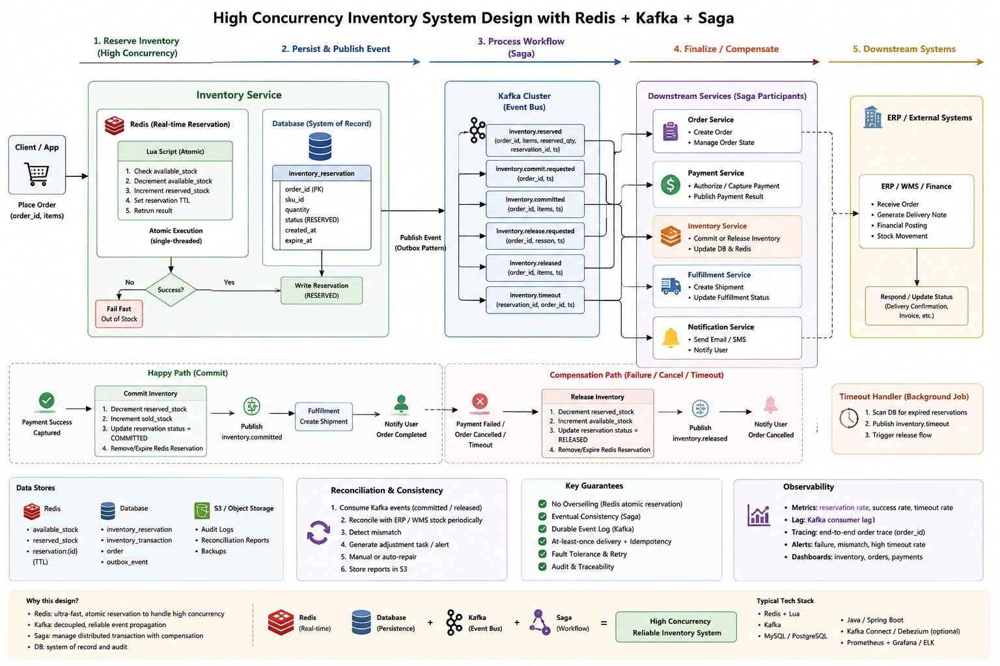

# Inventory OMS PoC

Spring Boot / Java reference for high-concurrency inventory reservation, Kafka-ready event handoff, Saga compensation and reconciliation.

This is the original OMS microservice-style PoC. Keep it beside `../oms-oltp-poc`: this project shows the Java / Spring Boot / DDD service shape, while the Python companion keeps the same OLTP ideas compact for side-by-side comparison with the OEE and CCE data-platform PoCs.

## Architecture Diagram



## What This Shows

- Inventory reservation service using a Spring Boot-style controller / service / repository layout
- DDD-friendly OMS boundaries: Order, Inventory, Payment, Fulfillment and Notification
- High-concurrency stock reservation pattern with Redis + Lua in the target architecture
- Database as system of record for reservations, orders and Outbox events
- Kafka-ready event flow for `inventory.reserved`, `inventory.committed`, `inventory.released` and timeout events
- Saga happy path and compensation path for payment failure, cancellation or reservation timeout
- Reconciliation job for inventory consistency checks against ERP / WMS / finance systems

## Local Structure

```text
inventory-oms-poc/
  README.md
  run.sh
  docker-compose.yml
  Makefile
  reservation-service/
    pom.xml
    src/main/java/com/poc/reservation/
      ReservationApplication.java
      controller/ReservationController.java
      service/ReservationService.java
      repository/ReservationRepository.java
      entity/Reservation.java
  reconciliation-job/
    pom.xml
    src/main/java/com/poc/recon/ReconciliationJob.java
```

## Design Narrative

For OLTP, the inventory service owns the current stock truth. The hot path reserves stock quickly, persists the reservation, and emits durable events through an Outbox/Kafka-style handoff. Downstream services then create orders, capture payments, update fulfillment status and notify users.

The same events can later feed OLAP systems. That is the bridge to the other PoCs in this repository: OMS produces operational facts, while OEE and CCE consume historical data for dashboards, features and decision support.

## From Events To OLAP Contracts

For OLAP, the important signal is not only the latest order or stock value, but how that value changed over time. The OMS Outbox events can become the immutable timeline for downstream models: facts, daily snapshots and slowly changing dimensions.

This is where data contracts and metadata governance matter:

- Data contract defines the producer-consumer promise: event schema, field meaning, time semantics, quality rules, ownership and freshness expectations.
- Metadata governance records and controls that promise through catalog metadata, lineage, access rules, audit history and schema evolution.
- ETL / ELT executes the promise by normalizing payloads, validating rules, deduplicating events, merging changes and building SCD or snapshot tables.

Lakehouse tools such as Unity Catalog and Delta Lake provide strong infrastructure for governed metadata, ACID table state, schema enforcement, table history and change capture. They do not automatically define the business meaning of fields such as `event_time`, `available_stock` or `reservation_status`; the team still has to make those contracts explicit.

For OLTP, idempotency usually protects commands such as retrying checkout. For OLAP, idempotency protects historical truth. A downstream model should use a stable `event_id` when available, or a version-aware key such as `business_key + event_time`, `business_key + source_updated_at` or `business_key + effective_from`, plus optional `sequence_number`, `batch_id` or `record_hash`. In OLTP, identity is often the record. In OLAP, identity is often the record version in time.

The companion [`../data-governance-poc`](../data-governance-poc/README.md) shows how to make this operational through schema checks, event payload checks, freshness monitoring, duplicate detection, timestamp deviation checks and inventory reconciliation.

- Detailed order flow: [`docs/ORDER_PAYMENT_FLOW.md`](docs/ORDER_PAYMENT_FLOW.md)

## Split Microservices Implementation

The original `reservation-service` remains as a regression baseline. The split implementation adds independently deployable Spring Boot modules:

```text
common-contracts   versioned command/event DTOs and status enums
order-service      order aggregate + Saga orchestrator, port 8081
inventory-service  stock row locks + reservation lifecycle, port 8082
payment-service    payment idempotency + refund + Ledger, port 8083
reconciliation-job cross-service reconciliation process
```

The split services use explicit ports/adapters:

- `OrderWorkflowService` coordinates reserve -> capture -> commit and compensations.
- `InventoryGateway` and `PaymentGatewayClient` are Order-side interfaces; current adapters use REST.
- `InventoryService` is the only writer of stock and reservation data.
- `PaymentService` is the only owner of payment transaction and Ledger data.
- Each service writes its own Outbox in its local database transaction.
- `LoggingDomainEventPublisher` is a local seam; production replaces it with Kafka/MSK or SQS adapter.
- Each service exposes Actuator health, Prometheus metrics and bounded scheduler configuration.

Run the local split version:

```bash
cd inventory-oms-poc
docker compose -f docker-compose.microservices.yml up --build
```

Detailed code boundaries are documented in [`docs/PRODUCTION_DEPLOYMENT_DEVSECOPS.md`](docs/PRODUCTION_DEPLOYMENT_DEVSECOPS.md), including AWS component selection, EKS/Helm deployment, monitoring, security and CI/CD.

Deployment and operations notes: [docs/PRODUCTION_DEPLOYMENT_DEVSECOPS.md](docs/PRODUCTION_DEPLOYMENT_DEVSECOPS.md).

The consolidated architecture, business flows, lock granularity, DevOps/SRE packaging, monitoring, multi-AZ deployment and troubleshooting runbook are in [docs/ARCHITECTURE_AND_DEVOPS.md](docs/ARCHITECTURE_AND_DEVOPS.md).

AWS networking, database high availability and scheduled scaling guidance is documented in [docs/AWS_DATABASE_AND_HA_LESSONS.md](docs/AWS_DATABASE_AND_HA_LESSONS.md) and [docs/SCHEDULED_SCALING_AND_RDS.md](docs/SCHEDULED_SCALING_AND_RDS.md).

## Distributed Transaction Implementation

This Java PoC implements the distributed-transaction notes from the referenced design document as a runnable Spring Boot flow. It deliberately uses **local database transactions + Saga compensation + Transactional Outbox**. It does not claim to implement cross-service 2PC; 2PC/TCC are alternative coordination patterns with different availability and operational trade-offs.

### Payment and inventory flow

```text
POST /reservation/create
  1. validate request and Idempotency-Key
  2. SELECT inventory_stock ... FOR UPDATE
  3. reserve available_qty -> reserved_qty
  4. save reservation + SagaLog + OutboxEvent in one @Transactional unit

POST /reservation/{orderId}/payment
  1. deduplicate by order_id + payment idempotency key
  2. lock reservation and stock in a stable order
  3. capture payment (the PoC uses succeed=true/false as a gateway stub)
  4. success: reserved -> sold, write balanced debit/credit ledger, emit events
  5. failure: release stock, mark compensation, emit failure/release events

Outbox publisher -> Inbox consumer
  1. publisher atomically reads pending local events and marks the PoC event as published
  2. production replacement is a Kafka/MSK relay with retry and DLQ
  3. consumer records event_id in InboxEvent, so broker redelivery is harmless

ReservationTimeoutScheduler -> expireReservations()
  scans RESERVED records and releases stock through the same compensation path.
```

### Code map to the core design concepts

| Concept | Current Java implementation |
|---|---|
| Prevent overselling / concurrent settlement | `InventoryStockRepository.findBySkuForUpdate()` and `InventoryStock @Version` |
| Request idempotency | `Reservation.idempotencyKey` and unique database constraints |
| Payment idempotency | `PaymentTransaction(orderId, idempotencyKey)` plus unique `providerRef` |
| Saga forward/reverse path | `SagaLog`, `capturePayment()`, `releaseReservation()`, cancellation and timeout scheduler |
| Local transaction to message | `OutboxEvent` is written in the same transaction as stock/payment state |
| Duplicate broker delivery | `InboxEvent` deduplicates event consumption by `eventId` |
| Payment accounting | immutable `LedgerEntry` with debit/credit balancing query |
| Reconciliation | `reconciliation-job` compares stock totals and ledger debit/credit totals |
| Optimistic concurrency | JPA `@Version` on stock, reservation and payment transaction |

The code is intentionally explicit for clarity: database locking protects the critical inventory row; idempotency protects client and gateway retries; Saga compensation handles payment failure and timeout; Outbox/Inbox handles the gap between a committed database transaction and message delivery.

### Run and inspect the flow

From `inventory-oms-poc/`:

```bash
mvn test
mvn -pl reservation-service spring-boot:run
```

Example requests:

```bash
curl -X POST "http://localhost:8080/reservation/create?orderId=ORDER-100&sku=SKU-RED-001&qty=2&orderAmountCents=2000&orderCurrency=CNY&ttlMinutes=15" -H "Idempotency-Key: reserve-100"
curl -X POST "http://localhost:8080/reservation/ORDER-100/payment" -H "Content-Type: application/json" -d "{\"idempotencyKey\":\"pay-100\",\"providerRef\":\"gateway-100\",\"amountCents\":2000,\"currency\":\"CNY\",\"succeed\":true}"
curl "http://localhost:8080/reservation/outbox"
curl "http://localhost:8080/reservation/ledger?orderId=ORDER-100"
```

The local publisher endpoint is a test seam, not a production guarantee: a real deployment needs Kafka/MSK, an Outbox relay with retry/backoff, DLQ, metrics and tracing. Redis/Lua can be added as the high-QPS front-door reservation accelerator, but the relational database remains the source of truth and reconciliation remains mandatory.

### Implementation rationale

> In the payment path, I use a local transaction for each service's own state, then Saga for the cross-service workflow. I lock the inventory row with `SELECT FOR UPDATE`, use an idempotency key for checkout and payment callbacks, and enforce uniqueness in the database. A successful payment commits reserved stock and writes balanced ledger entries; a failed payment or timeout releases the reservation through a compensating action. The Outbox is committed with the business state, and the Inbox makes Kafka redelivery safe. I would not describe this as 2PC: production would use Kafka/MSK plus an Outbox relay, DLQ, observability and reconciliation.

### PoC boundary and production hardening

- The current `PaymentRequest` is a gateway stub. The reservation snapshot already rejects amount/currency mismatches; a production gateway adapter must additionally verify signed callbacks and provider reference uniqueness before capture.
- The current H2 file database makes the flow runnable locally. Production should use PostgreSQL/Aurora, migrations, encrypted storage, KMS-managed secrets and least-privilege IAM.
- For China/domestic and overseas data, keep payment/order PII in the owning regional boundary; export only an allow-listed, tokenized event payload to the other region. Add classification, residency policy checks, audit logs, retention/deletion workflows and region-scoped encryption keys before cross-border replication.
## Outbox delivery contract and broker choice

The split services use a transactional Outbox in each service-owned database. The business state and its domain event are committed in the same local ACID transaction. A relay then claims rows with a short lease, publishes outside the database transaction, marks the row `PUBLISHED` only after the transport acknowledges it, and retries with backoff. An expired lease is deliberately redeliverable: the delivery guarantee is at-least-once, so every consumer must use an Inbox table with a unique `event_id` before applying business effects.

The event envelope contains `schemaVersion`, `occurredAt` and a stable `partitionKey` (the aggregate/order ID). A Kafka adapter uses that value as the record key to preserve per-order ordering within a partition. An SQS FIFO adapter uses it as `MessageGroupId` and `eventId` as `MessageDeduplicationId`; the SQS deduplication window is only an optimization and cannot replace Inbox/idempotent business handling. A real adapter must wait for the broker acknowledgement before returning from `DomainEventPublisher.publish`.

| Requirement | Kafka/MSK | SQS FIFO + DLQ |
|---|---|---|
| Best fit | High event volume, replay, many consumer groups and stream processing | Lower operational overhead, command/work-queue delivery and simple fan-out |
| Ordering key | `DomainEvent.partitionKey` -> Kafka record key/partition | `DomainEvent.partitionKey` -> FIFO message group |
| Duplicate protection | Consumer Inbox; producer idempotence does not include the database transaction | Consumer Inbox; FIFO deduplication is time-bounded |
| Failure handling | Relay retry plus consumer retry/DLQ and lag alerts | Visibility timeout, retry policy and DLQ; monitor age/depth |
| Database consistency | Still needs the local Outbox; Kafka transactions do not atomically commit an arbitrary business database | Still needs the local Outbox; SQS has no database transaction |

This is why Outbox, Kafka/SQS and Saga/TCC are complementary: Outbox closes the local database-to-message gap, Kafka/SQS transports the event, and Saga/TCC handles cross-service business compensation. The guarantee is needed even at low concurrency because a process crash can happen between any two writes; it is not a throughput-only optimization. The current PoC defaults to `messaging.transport=logging`, while production supplies a Kafka/MSK or SQS adapter without changing the business services.

The RTF review items about in-memory stock/user state and per-request thread-pool creation do not apply to this split implementation: inventory state is already persisted and protected by a SKU row lock, idempotency is database-enforced, and schedulers are singleton bounded Spring beans. The upload-platform review is outside this POC because it has no upload flow.

## Production broker adapters and flash-sale path

The three split services now include conditional production adapters:

- messaging.transport=logging keeps local tests deterministic.
- messaging.transport=kafka uses KafkaTemplate, waits for the producer acknowledgement, enables acks=all and producer idempotence, and uses DomainEvent.partitionKey as the record key.
- messaging.transport=sqs uses the AWS SDK async client and waits for SendMessage acknowledgement. SQS FIFO uses partitionKey as MessageGroupId and eventId as the deduplication ID. Standard SQS does not provide ordering, so consumers still need an Inbox and business idempotency.

The Redis/Lua flash-sale path is opt-in with seckill.redis.enabled=true. Before opening a sale, the inventory service moves a bounded quota from availableQty to seckillAllocatedQty. The Lua script then atomically checks quota, rejects duplicate users/request keys, decrements Redis and appends a Redis Stream record. A bounded Spring consumer persists the reservation from the allocated quota and acknowledges the stream only after the database transaction commits. Failed records retry and eventually move to a Redis DLQ; an unpersisted record returns its allocated quota.

This separation is important: Redis is the high-QPS admission layer, while the relational database remains the source of truth. Normal DB reservations cannot consume the units already allocated to the flash-sale path, so Redis-pending requests cannot cause database overselling. The Redis keys use a SKU hash tag so the Lua script remains compatible with Redis Cluster.

The concurrency controls are deliberately explicit:

    same SKU -> one database row lock for normal/commit/release paths
    different SKU -> independent lock scope
    same user/request -> Redis Lua deduplication
    same event -> Outbox lease + consumer Inbox/idempotency
    external broker call -> outside DB transaction

The design is production-oriented but still needs environment hardening before a live launch: PostgreSQL/Aurora migrations instead of H2 ddl-auto=update, IAM/mTLS for internal endpoints, Redis ACL/TLS, broker topic/queue policies, DLQ alarms, Redis Stream auto-claim across consumer identities, deadlock/lock-timeout retry policy, and a durable sale-launch/reconciliation workflow for the DB-to-Redis quota initialization.

## Implemented observability and algorithm hardening

- All four Spring services expose Actuator/Prometheus metrics, explicit JVM/process/system metric binders and HTTP percentile histograms; OTEL bridge dependencies are enabled for trace export when `OTEL_TRACING_ENABLED=true`.
- Reservation expiration is a bounded, ordered batch scan with `oms_reservation_expiration_total` and `oms_reservation_expiration_duration`; the database status lock and JPA version check remain the correctness boundary.
- Redis seckill admission now caps the main Stream with approximate `MAXLEN`, caps and expires the DLQ, and exposes admission outcome, Stream length, DLQ depth and record processing metrics.
- `docker-compose.kraft.yml` provides a local KRaft topology while the original compose file remains the ZooKeeper compatibility setup.
- JFR helpers and the metric checklist are in `observability/JVM_OBSERVABILITY_RUNBOOK.md`.
- `algorithm-review` now includes Python/Go/C++ examples for sharded Top-K merge and stable Cursor/Keyset pagination.

## Optional strict-order inventory reservation

The default order flow remains synchronous HTTP reservation. When the business
requires FIFO allocation for a scarce SKU, set
`inventory.reservation.mode=sqs-fifo` and configure the FIFO command/result
queues. The Order Outbox then sends commands grouped by `sku:<sku>`; Inventory
Service applies them with the existing database row lock and returns a result
that resumes payment, commit or compensation. See
[`docs/ORDER_INVENTORY_FIFO_SQS.md`](docs/ORDER_INVENTORY_FIFO_SQS.md).

This path is separate from Redis/Lua flash-sale admission. Redis Lua keeps
quota decrement and Redis Stream append in one atomic operation, so the POC
does not introduce a Redis-success/SQS-failure gap by replacing that Stream
without a separate reconciliation protocol.

AWS 网络与安全选型、VPC Endpoint、EKS 工作负载权限、KMS/Macie 以及 Authentication/Authorization 模型见 [docs/AWS_NETWORK_AND_SECURITY_PATTERNS.md](docs/AWS_NETWORK_AND_SECURITY_PATTERNS.md)。
